# Rendering Gallery

This gallery showcases what the Rendering library can produce. Every image is generated by the gallery test project
directly from the public API, so this page doubles as an end-to-end rendering smoke test.

Regenerate this page and its images by running `./gallery.ps1` from the repository root.

## Layout algorithms

The bundled algorithms, each laying out the same kind of node-and-edge graph in its own style. Select one with the
algorithm option and let the engine place the boxes and route the edges.

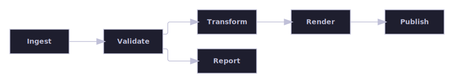

A directed pipeline laid out left to right by the layered algorithm.

Sibling boxes packed compactly by the containment algorithm.

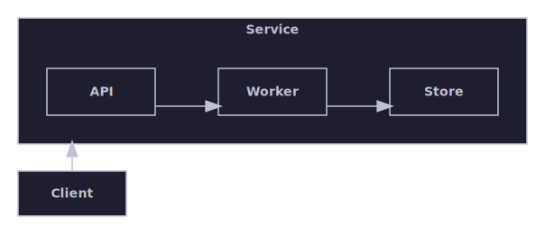

A container node holding a nested child graph, with a cross-container edge.

## Flow direction

The same directed graph laid out in two flow directions, selected with the direction option, plus a nested container
overriding its own direction independently of its parent. A rightward flow arranges the layers left-to-right for block
and pipeline diagrams; a downward flow arranges them top-to-bottom for action flows and state machines, swapping each
node's width and height so layer spacing follows node height.

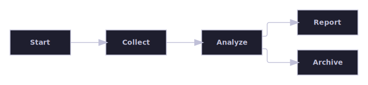

The default rightward direction: layers progress left-to-right.

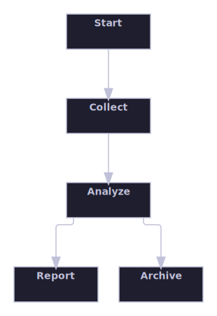

The downward direction: the same graph's layers progress top-to-bottom.

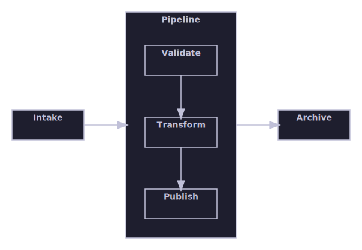

A container's own direction override is honored independently of its parent: the outer flow runs left-to-right while the
nested container runs top-to-bottom.

## Edge routing

Orthogonal connectors step around the boxes between their endpoints instead of cutting through them.

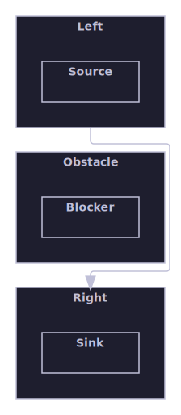

A connector routed orthogonally around an intervening container box.

## Themes

One representative diagram rendered with each of the three built-in themes, showing how the theme controls colours,
stroke, and corner style without touching the layout. These are rendered through the raster path to PNG so each carries
a solid theme background.

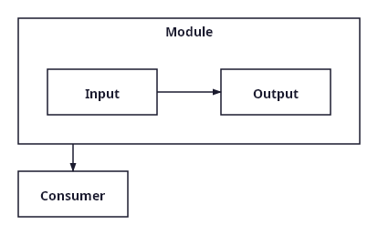

The light theme, suited to on-screen viewing.

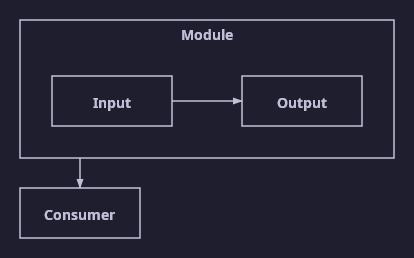

The dark theme, suited to dark-mode viewing.

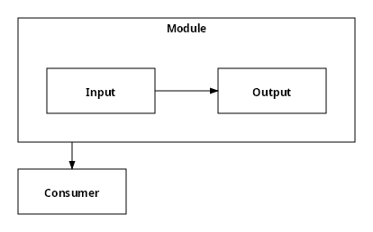

The print theme, optimised for black-and-white output.

## Raster output

The layout-algorithm diagrams above are rendered as SVG with the dark theme; here the same two diagrams are rendered
through the SkiaSharp raster path to PNG, proving multi-format output.

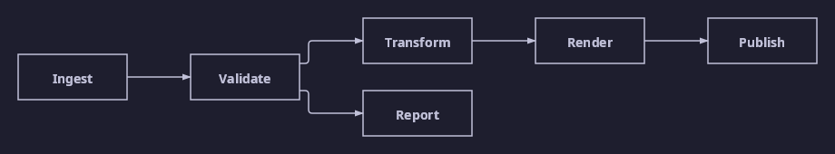

The layered pipeline rendered to a raster PNG image.

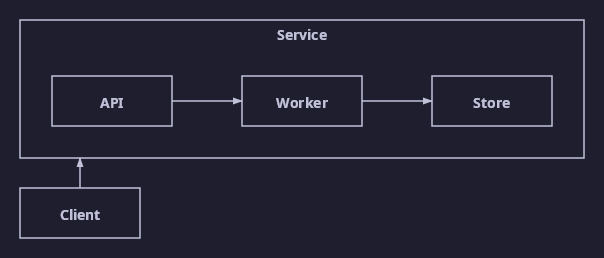

The hierarchical nested diagram rendered to a raster PNG image.

## Box appearance

A node's Shape, Keyword, and Compartments properties select the box outline, an italicized keyword line, and labelled
feature sections, all through the plain input graph model — no downstream renderer-specific code required. This is
generic block-diagram notation; SysML is just one modeling language that uses it.

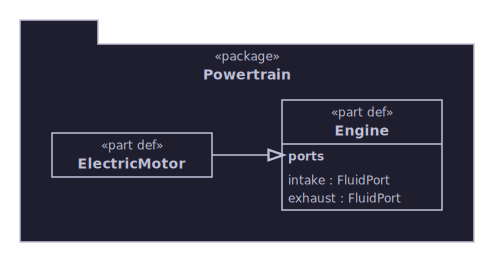

A folder container holding two boxes with a keyword line — one also with a labelled compartment — joined by a decorated
edge.

## Shape-aware connectors

A box's Shape can make its true outline diverge from its plain bounding rectangle — a folder's tab, a note's folded
corner, a rounded rectangle's corners. The router keeps connectors off those non-connectable regions and projects each
anchor down to the shape's actual drawn outline, so every connector visibly touches the shape it targets.

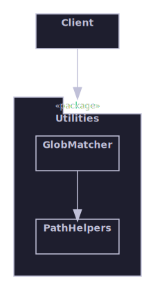

An edge approaching a folder container from above: the connector avoids the tab and anchors on the folder's recessed top
edge instead of floating above it.

Every Shape value side by side, each with content appropriate to it: rectangle and rounded-rectangle boxes with a
keyword and a compartment, a folder holding a nested child, and a note holding free-form text — every shape reserves
enough space so its content never overlaps the tab or the folded corner.

## Parallel edges and named ports

The layered algorithm's Phase 1 flat-graph support for multiple parallel connectors between the same two boxes, and for
named ports attached to a specific, labelled location on a node's boundary. Parallel edges either collapse to one
rendered connector (the default) or each keep their own independently-routed line, selected with the MergeParallelEdges
option; each node's ContentInset margins are auto-computed from its ports' measured label widths so port text never
overlaps the box's own content.

MergeParallelEdges set to false: all three parallel connectors survive, each with its own label.

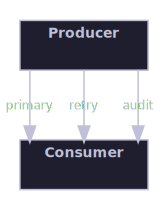

The companion vertical-flow case: with a downward Direction the three parallel connectors anchor on the boxes' top and
bottom faces instead of their left and right faces, and each box's WIDTH (not height) auto-grows to fit the widened lane
spacing, since PortDistributor spreads anchors on a top/bottom face horizontally.

The default MergeParallelEdges (true): the three parallel connectors collapse to a single rendered line, and its
midpoint label is omitted entirely (not any single surviving connector's label) since a reader could not tell which of
the three collapsed connectors a kept label would have belonged to.

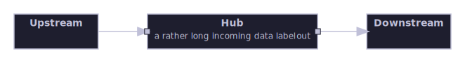

Left/right named ports on a rightward-flowing hub node; the long left-side incoming label auto-computes a widened
ContentInsetLeft margin, measured with the Skia-backed text measurer.

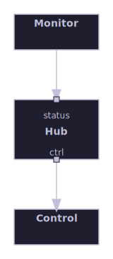

The companion top/bottom case: a downward-flowing hub node, whose ports anchor on its top and bottom faces instead.

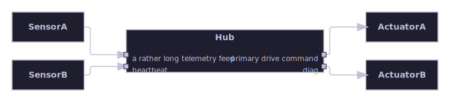

Same-face crowding with two independently-labelled ports per side (one deliberately long): PortDistributor spreads both
anchors on each face without collapsing them onto one row, and the hub's title stays clear of both stacked rows on
either side.

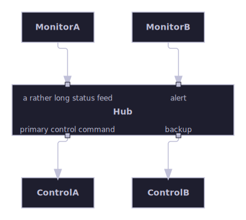

The companion top/bottom case: two ports per face spread horizontally instead of vertically, proving the same crowding
and title-collision protection when PortDistributor works along the cross axis of a downward flow.

## Boundary and delegation ports

The hierarchical engine's support for boundary (delegation) ports: a container may expose a named port carrying BOTH an
external and an internal label at one shared physical anchor on its boundary. An external approach edge from a sibling
reaches the anchor from outside, while one or more internal delegation edges relay the connection inward to the
container's nested children. The container and its children are laid out in one combined recursive pass, and every
converging edge — external approach and internal delegation alike — is routed through the orthogonal corridor router
onto that single shared anchor, with the external label reading outward and the internal label reading inward.

A rightward-flowing container exposes one boundary port on its left face carrying both a 'command' external label
(reading outward) and a 'dispatch' internal label (reading inward) at the same shared anchor. The external approach edge
from the sibling and both internal delegation edges (internal fan-out to two nested children) are routed orthogonally
onto that one anchor.

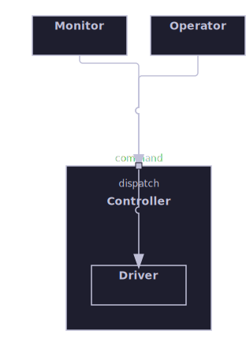

The companion downward-flowing case: the boundary port anchors on the container's top face, with external fan-out (two
sibling approach edges) both routed orthogonally onto the one shared anchor, which then delegates inward to the single
nested child.

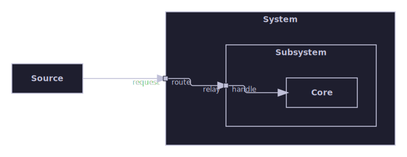

A three-level delegation chain: a sibling approaches an outer container's boundary port, which delegates inward to a
nested container's own boundary port, which delegates again to the innermost leaf. Both boundary crossings carry an
outward external and an inward internal label, and the whole chain is routed orthogonally in one combined recursive pass
with no diagonal shortcut at either boundary.
