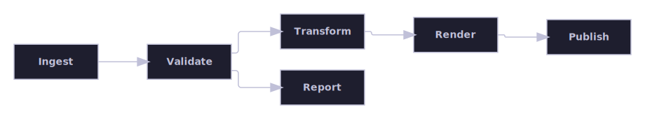
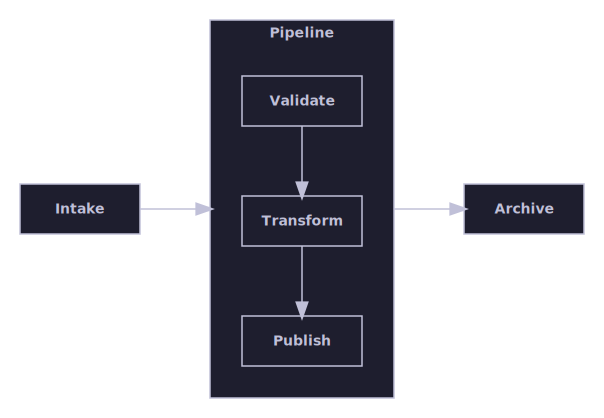
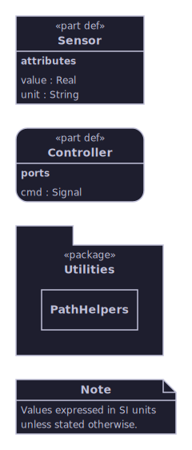

# Rendering Gallery

See what the Rendering library can do with your own data. Every image below is generated by the gallery test project
directly from the public API — this page doubles as an end-to-end rendering smoke test, not a set of hand-drawn
mock-ups. Regenerate every page and image by running `./gallery.ps1` from the repository root.

Bring a graph shaped like yours and find its group below: each one takes the *same kind* of input data and lays it out
with several of the bundled algorithms side by side, so you can see whether the automatic `auto` choice looks right for
your case or whether you'd rather call a specific algorithm directly. The one exception is **Appearance and themes**,
which is grouped by visual capability instead of input shape. **Layout regressions** is kept separate too, as a
permanent record of bugs that were fixed and must stay fixed.

Each group's own page has the full diagram set with detailed captions explaining what each one demonstrates and, where
relevant, which bug it guards against. This page just points the way and shows a taste of each.

| Group | What it's about |

| --- | --- |

| [Flow pipeline](flow-pipeline/README.md) | A single connected, directed flow — pipelines and direction changes |
| [Connectivity and clusters](connectivity-and-clusters/README.md) | Connected vs. disconnected input and clusters |
| [Nested hierarchy](nested-hierarchy/README.md) | Parent/child containment and boundary-port delegation |
| [Parallel edges and ports](parallel-edges-and-ports/README.md) | Many edges between few boxes, named/boundary ports |
| [Appearance and themes](appearance-and-themes/README.md) | Box shapes, keywords, compartments, and built-in themes |
| [Layout regressions](layout-regressions/README.md) | Permanent visual proof that fixed layout bugs stay fixed |
| [Custom rendering](custom-rendering/README.md) | Hand-built LayoutTrees, bypassing the layout engine entirely |

## A taste of what's inside

A directed pipeline laid out left to right by the layered algorithm. See [Flow pipeline](flow-pipeline/README.md) for
the full set.

A container's own direction override is honored independently of its parent: the outer flow runs left-to-right while the
nested container runs top-to-bottom. See [Flow pipeline](flow-pipeline/README.md) for the full set.

The same three-cluster graph routed through "auto": each cluster is its own connected component, so each is laid out by
the layered algorithm independently and the three results are packed into one combined canvas. See [Connectivity and
clusters](connectivity-and-clusters/README.md) for the full set.

Twelve identically-sized, wide boxes: the column-count-based content-width candidate keeps the containment algorithm
from packing them into one long, narrow column, wrapping them into a balanced grid of columns instead. See [Connectivity
and clusters](connectivity-and-clusters/README.md) for the full set.

A three-level delegation chain: a sibling approaches an outer container's boundary port, which delegates inward to a
nested container's own boundary port, which delegates again to the innermost leaf. Both boundary crossings carry an
outward external and an inward internal label, and the whole chain is routed orthogonally in one combined recursive pass
with no diagonal shortcut at either boundary. See [Nested hierarchy](nested-hierarchy/README.md) for the full set.

Regression coverage for the parallel-edges-into-compartment-box fix: nine unmerged edges from a small Source box
converge on a taller Target box's nine-row compartment. ConnectorRouter now treats every box, including a connection's
own endpoints, as a hard obstacle for the whole route (not just the final docking stub), so a connector squeezed by
other already-routed connectors can no longer detour straight through its own target box's interior. See [Parallel edges
and ports](parallel-edges-and-ports/README.md) for the full set.

Every Shape value side by side, each with content appropriate to it: rectangle and rounded-rectangle boxes with a
keyword and a compartment, a folder holding a nested child, and a note holding free-form text — every shape reserves
enough space so its content never overlaps the tab or the folded corner. See [Appearance and
themes](appearance-and-themes/README.md) for the full set.
