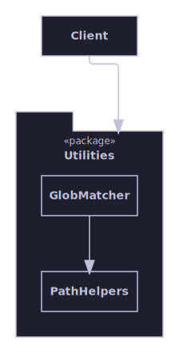
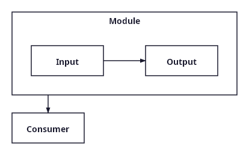
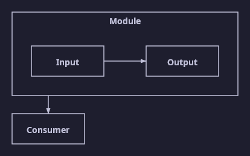

# Appearance and themes

Not a topology grouping — box shape/keyword/compartments, shape-aware connector anchoring, and theme showcases,
organized pragmatically by appearance rather than by topology, unlike the rest of this gallery.

[Back to the gallery index](../README.md)

## Box appearance

A node's Shape, Keyword, and Compartments properties select the box outline, an italicized keyword line, and labelled
feature sections, all through the plain input graph model — no downstream renderer-specific code required. This is
generic block-diagram notation; SysML is just one modeling language that uses it.

A folder container holding two boxes with a keyword line — one also with a labelled compartment — joined by a decorated
edge.

## Shape-aware connectors

A box's Shape can make its true outline diverge from its plain bounding rectangle — a folder's tab, a note's folded
corner, a rounded rectangle's corners. The router keeps connectors off those non-connectable regions and projects each
anchor down to the shape's actual drawn outline, so every connector visibly touches the shape it targets.

An edge approaching a folder container from above: the connector avoids the tab and anchors on the folder's recessed top
edge instead of floating above it.

Every Shape value side by side, each with content appropriate to it: rectangle and rounded-rectangle boxes with a
keyword and a compartment, a folder holding a nested child, and a note holding free-form text — every shape reserves
enough space so its content never overlaps the tab or the folded corner.

## Themes

One representative diagram rendered with each of the three built-in themes, showing how the theme controls colours,
stroke, and corner style without touching the layout. These are rendered through the raster path to PNG so each carries
a solid theme background.

The light theme, suited to on-screen viewing.

The dark theme, suited to dark-mode viewing.

The print theme, optimised for black-and-white output.
