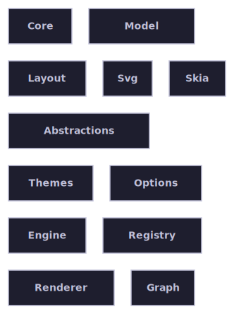
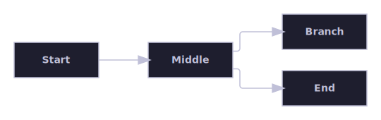
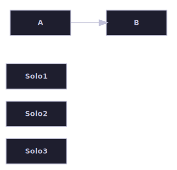
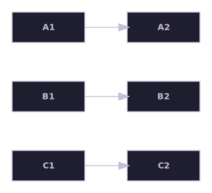
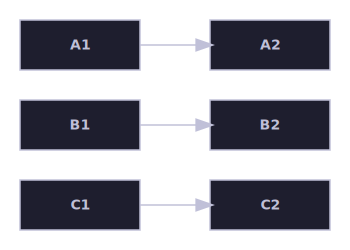
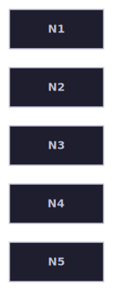
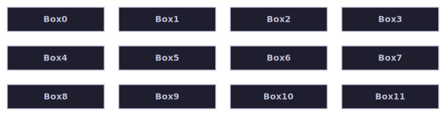

# Connectivity and clusters

Compares a normal, fully-connected graph against graphs with little or no connectivity between nodes — isolated
singletons and/or multiple unrelated components — across the containment, auto, and layered algorithms.

[Back to the gallery index](../README.md)

## Layout algorithms

The bundled algorithms, each laying out the same kind of graph in its own style. Select one with the algorithm option
and let the engine place the boxes and route any edges.

Sibling boxes packed compactly by the containment algorithm.

## Baseline: a fully-connected graph, for contrast

Before the disconnected-graph comparisons in the next section, this baseline shows the same kind of small pipeline fully
connected, laid out directly by the layered algorithm — the normal, connected case the "auto" meta-algorithm examples
below are deliberately contrasted against.

A baseline, fully-connected graph laid out directly by the layered algorithm, for visual contrast with the
disconnected-graph diagrams in the next section.

## The auto meta-algorithm

The bundled "auto" algorithm splits the input graph into its connected top-level components, routes each component to
whichever bundled leaf algorithm best suits its shape — layered for a connected cluster, hierarchical for any component
holding a container node, containment for the shared bucket of childless, edgeless singletons — lays each piece out
independently, and packs the results into one combined canvas.

The "auto" algorithm routes the two-node cluster through the layered algorithm and gathers the three unrelated
singletons into one shared bucket routed through the containment algorithm, then packs both pieces into one canvas.

The same three-cluster graph routed through "auto": each cluster is its own connected component, so each is laid out by
the layered algorithm independently and the three results are packed into one combined canvas.

The companion direct-"layered" sibling of the diagram above: the same disconnected graph, laid out by the layered
algorithm's own internal component packing rather than "auto"'s per-component routing, for comparison.

A graph of nothing but childless, edgeless singleton nodes: "auto" gathers every one of them into the shared bucket and
routes the whole graph through the containment algorithm unchanged, taking its zero-copy fast path.

## Containment packing heuristics

The containment algorithm derives its row-wrapping content-width budget from the packed boxes' shape, combining an
area-based estimate with a column-count-based one so both a few large boxes and many small ones wrap into a balanced
block.

Twelve identically-sized, wide boxes: the column-count-based content-width candidate keeps the containment algorithm
from packing them into one long, narrow column, wrapping them into a balanced grid of columns instead.
