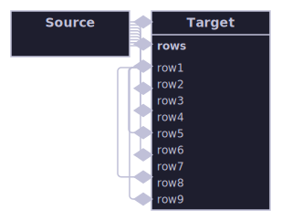

# Custom rendering

Every other group in this gallery shows what the layout engine itself produces: describe a graph, call
LayoutEngine.Layout, render the result. This group is the deliberate exception. Its diagrams are hand-built LayoutTrees
with boxes placed at explicit, hardcoded coordinates, rendered by calling ConnectorRouter and the renderers directly —
no layout algorithm is involved at all. This is a legitimate, fully public capability (every type used here is public),
so it earns its own honestly-labelled home rather than being mixed into a showcase of algorithm output. Expect rough
edges: nothing here benefited from any algorithm's spacing or routing intelligence, and a person taking this path on
their own diagrams should expect the same trade-off.

[Back to the gallery index](../README.md)

## Direct ConnectorRouter regression coverage

Regression coverage that requires an exact, hardcoded box arrangement no layout algorithm currently produces, kept as
permanent visual and numeric evidence that a specific connector-routing bug stays fixed regardless of which algorithm
(or future heuristic change) might eventually produce a similar arrangement.

Regression coverage for the OrthogonalEdgeRouter narrow-gap tangling fix: a small Source box placed explicitly beside a
taller, nine-row-compartment Target box with a narrow gap between them, joined by nine hand-routed connectors (bypassing
any layout algorithm, so this exact geometry stays covered regardless of which algorithm or future heuristic change
might produce it). Before the fix, each successive parallel connector's own soft-obstacle avoidance offset its candidate
lane a little further from the shared gap with no ceiling, eventually looping a route back behind the Source box it had
already left; the router now clamps soft-obstacle lane candidates to the box pair's own envelope and penalizes (without
blocking) any move that still leaves it. The router also now prices a connector transversally crossing another
already-routed connector's trunk (OrthogonalEdgeRouter's SoftObstacleCrossingCost), so a connector with a genuinely
bounded-cost non-crossing alternative takes it; this gap is saturated enough (nine connectors, one alternate lane) that
one connector's own approach stub still crosses two others' trunks here, because that connector is routed before the two
it later crosses and so cannot see them as obstacles yet — a known single-pass routing-order limitation, not a pricing
gap, left as documented residual behavior rather than force a much wider routing-order change for this one saturated
diagram.
