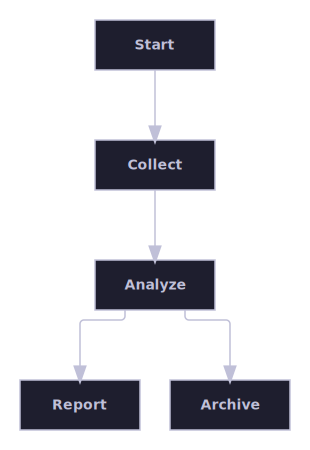
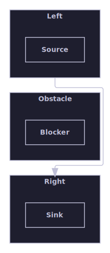
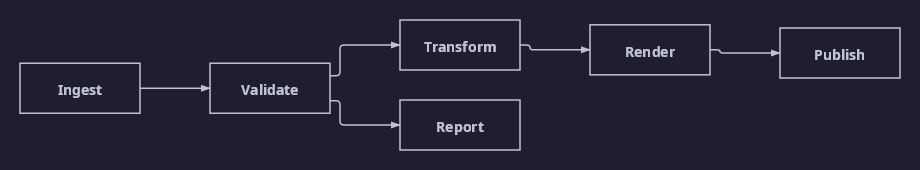

# Flow pipeline

A single connected component with a directed left-to-right or top-to-bottom flow — what a pipeline or flow diagram looks
like once laid out and routed.

[Back to the gallery index](../README.md)

## Layout algorithms

The bundled algorithms, each laying out the same kind of graph in its own style. Select one with the algorithm option
and let the engine place the boxes and route any edges.

A directed pipeline laid out left to right by the layered algorithm.

## Flow direction

The same directed graph laid out in two flow directions, selected with the direction option, plus a nested container
overriding its own direction independently of its parent. A rightward flow arranges the layers left-to-right for block
and pipeline diagrams; a downward flow arranges them top-to-bottom for action flows and state machines, swapping each
node's width and height so layer spacing follows node height.

The default rightward direction: layers progress left-to-right.

The downward direction: the same graph's layers progress top-to-bottom.

A container's own direction override is honored independently of its parent: the outer flow runs left-to-right while the
nested container runs top-to-bottom.

## Edge routing

Orthogonal connectors step around the boxes between their endpoints instead of cutting through them.

A connector routed orthogonally around an intervening container box.

## Raster output

One of the layout-algorithm diagrams above is rendered again here through the SkiaSharp raster path to PNG with the same
dark theme, proving multi-format output.

The layered pipeline rendered to a raster PNG image.
