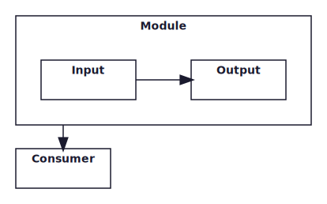
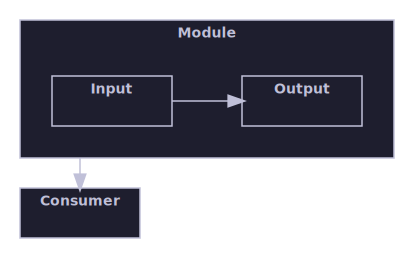
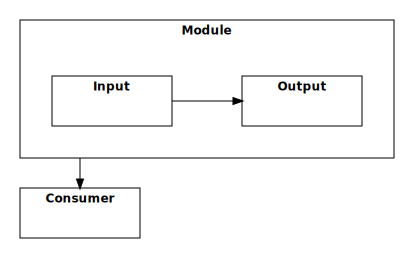

# Rendering Gallery

This gallery showcases what the Rendering library can produce. Every image is generated by the gallery test project
directly from the public API, so this page doubles as an end-to-end rendering smoke test.

Regenerate this page and its images by running `./gallery.ps1` from the repository root.

## Layout algorithms

The bundled algorithms, each laying out the same kind of node-and-edge graph in its own style. Select one with the
algorithm option and let the engine place the boxes and route the edges.

A directed pipeline laid out left to right by the layered algorithm.

Sibling boxes packed compactly by the containment algorithm.

A container node holding a nested child graph, with a cross-container edge.

## Edge routing

Orthogonal connectors step around the boxes between their endpoints instead of cutting through them.

A connector routed orthogonally around an intervening container box.

## Themes

One representative diagram rendered with each of the three built-in themes, showing how the theme controls colours,
stroke, and corner style without touching the layout.

The light theme, suited to on-screen viewing.

The dark theme, suited to dark-mode viewing.

The print theme, optimised for black-and-white output.

## Raster output

The same diagrams rendered through the SkiaSharp raster path to prove multi-format output. Every diagram above is
available as SVG; these two are additionally rendered to PNG.

The layered pipeline rendered to a raster PNG image.

The hierarchical nested diagram rendered to a raster PNG image.
