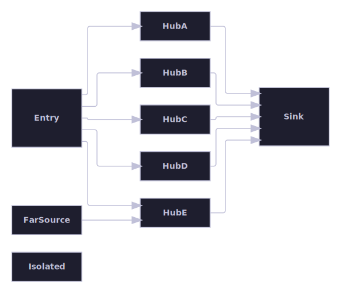

# Layout regressions

Kept as its own group per its organizing principle: bug history, not topology. Small graphs that reproduce and pin down
a specific layout bug once fixed, kept as permanent visual and numeric evidence that it stays fixed.

[Back to the gallery index](../README.md)

## Isolated-node layer-gap fix

Small graphs that reproduce and pin down a specific layout bug once fixed, kept as permanent visual and numeric evidence
that it stays fixed.

Regression coverage for the isolated-node layer-gap fix: a genuinely isolated node (Isolated, zero edges) shares its
layer with a dummy bend point created by an unrelated long edge (LongSource to LongTarget). The crossing minimizer now
clusters isolated nodes at the end of the layer's order, and coordinate assignment squeezes any resulting gap down to
the standard node spacing, instead of inheriting the dummy's unrelated port-alignment floor as an inflated gap.
