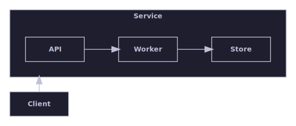
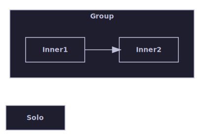
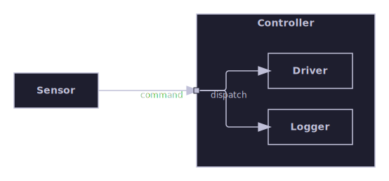
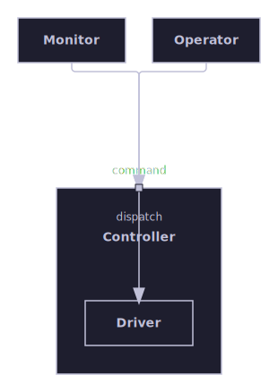
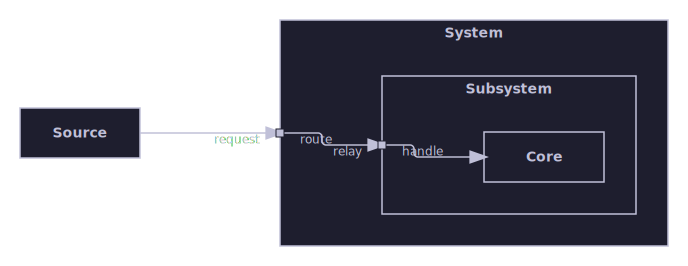

# Nested hierarchy

Parent/child containment and boundary-port delegation into nested children — what a container-with-children graph looks
like once laid out and routed.

[Back to the gallery index](../README.md)

## Layout algorithms

The bundled algorithms, each laying out the same kind of graph in its own style. Select one with the algorithm option
and let the engine place the boxes and route any edges.

A container node holding a nested child graph, with a cross-container edge.

## Raster output

One of the layout-algorithm diagrams above is rendered again here through the SkiaSharp raster path to PNG with the same
dark theme, proving multi-format output.

The hierarchical nested diagram rendered to a raster PNG image.

## The auto meta-algorithm

The bundled "auto" algorithm splits the input graph into its connected top-level components, routes each component to
whichever bundled leaf algorithm best suits its shape — layered for a connected cluster, hierarchical for any component
holding a container node, containment for the shared bucket of childless, edgeless singletons — lays each piece out
independently, and packs the results into one combined canvas.

"auto" routes any component containing a container node through the hierarchical algorithm regardless of its size, while
the unrelated isolated sibling is packed alongside it through the shared containment bucket.

## Boundary and delegation ports

The hierarchical engine's support for boundary (delegation) ports: a container may expose a named port carrying BOTH an
external and an internal label at one shared physical anchor on its boundary. An external approach edge from a sibling
reaches the anchor from outside, while one or more internal delegation edges relay the connection inward to the
container's nested children. The container and its children are laid out in one combined recursive pass, and every
converging edge — external approach and internal delegation alike — is routed through the orthogonal corridor router
onto that single shared anchor, with the external label reading outward and the internal label reading inward.

A rightward-flowing container exposes one boundary port on its left face carrying both a 'command' external label
(reading outward) and a 'dispatch' internal label (reading inward) at the same shared anchor. The external approach edge
from the sibling and both internal delegation edges (internal fan-out to two nested children) are routed orthogonally
onto that one anchor.

The companion downward-flowing case: the boundary port anchors on the container's top face, with external fan-out (two
sibling approach edges) both routed orthogonally onto the one shared anchor, which then delegates inward to the single
nested child.

A three-level delegation chain: a sibling approaches an outer container's boundary port, which delegates inward to a
nested container's own boundary port, which delegates again to the innermost leaf. Both boundary crossings carry an
outward external and an inward internal label, and the whole chain is routed orthogonally in one combined recursive pass
with no diagonal shortcut at either boundary.
