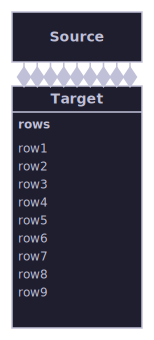
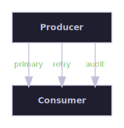
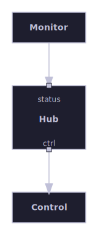
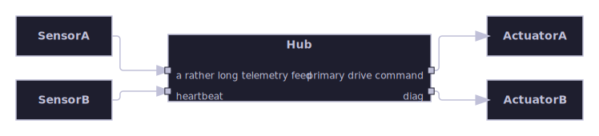
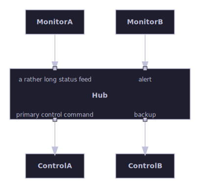
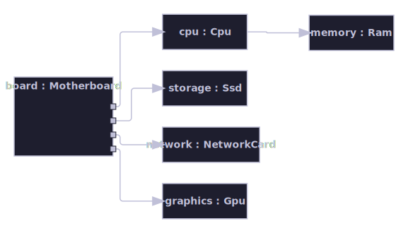
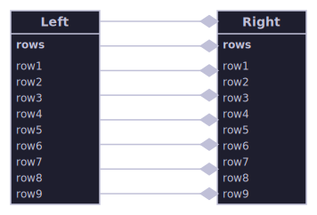
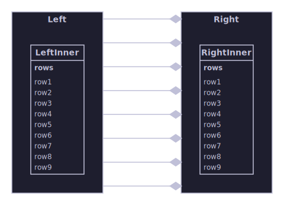

# Parallel edges and ports

Dense parallel connections between a small number of boxes, including named/boundary ports and edge-count-aware gap
widening — the same small-box-count-many-edges shape compared across algorithms.

[Back to the gallery index](../README.md)

## Parallel-edge routing regressions

Regression coverage specific to routing many parallel connectors around and between boxes: a small graph, laid out by
the containment algorithm, that reproduces a specific connector-routing bug once fixed, kept as permanent visual and
numeric evidence that it stays fixed.

Regression coverage for the parallel-edges-into-compartment-box fix: nine unmerged edges from a small Source box
converge on a taller Target box's nine-row compartment. ConnectorRouter now treats every box, including a connection's
own endpoints, as a hard obstacle for the whole route (not just the final docking stub), so a connector squeezed by
other already-routed connectors can no longer detour straight through its own target box's interior.

## Parallel edges and named ports

The layered algorithm's Phase 1 flat-graph support for multiple parallel connectors between the same two boxes, and for
named ports attached to a specific, labelled location on a node's boundary. Parallel edges either collapse to one
rendered connector (the default) or each keep their own independently-routed line, selected with the MergeParallelEdges
option; each node's ContentInset margins are auto-computed from its ports' measured label widths so port text never
overlaps the box's own content.

MergeParallelEdges set to false: all three parallel connectors survive, each with its own label.

The companion vertical-flow case: with a downward Direction the three parallel connectors anchor on the boxes' top and
bottom faces instead of their left and right faces, and each box's WIDTH (not height) auto-grows to fit the widened lane
spacing, since PortDistributor spreads anchors on a top/bottom face horizontally.

The default MergeParallelEdges (true): the three parallel connectors collapse to a single rendered line, and its
midpoint label is omitted entirely (not any single surviving connector's label) since a reader could not tell which of
the three collapsed connectors a kept label would have belonged to.

Left/right named ports on a rightward-flowing hub node; the long left-side incoming label auto-computes a widened
ContentInsetLeft margin, measured with the Skia-backed text measurer.

The companion top/bottom case: a downward-flowing hub node, whose ports anchor on its top and bottom faces instead.

Same-face crowding with two independently-labelled ports per side (one deliberately long): PortDistributor spreads both
anchors on each face without collapsing them onto one row, and the hub's title stays clear of both stacked rows on
either side.

The companion top/bottom case: two ports per face spread horizontally instead of vertically, proving the same crowding
and title-collision protection when PortDistributor works along the cross axis of a downward flow.

A face with several ports carrying no label or text at all still grows the box tall enough to keep them from bunching
together — the growth floor applies unconditionally to any face with two or more anchors, not only labeled ones.

## Edge-count gap widening

When many parallel connectors fan through the single gap between two side-by-side boxes, that gap is widened in
proportion to the connector count so each connector gets its own orthogonal routing lane instead of being crushed into
one narrow channel — the same corridor-width reservation the layered pipeline already makes between its columns, now
applied to the containment packer's same-row pairs and to the hierarchical engine's side-by-side sibling containers.

The containment algorithm packs two tall, compartment-bearing peer boxes side by side and widens the horizontal gap
between them in proportion to the eight parallel connectors routed through it, so the connectors fan cleanly into
distinct lanes rather than crowding a fixed-width channel.

The hierarchical engine places two peer containers side by side and widens the gap between them for the eight
cross-container connectors that fan child-to-child through it — spacing the per-scope leaf algorithm alone cannot
reserve, because those edges never appear in the sized view it lays out.
